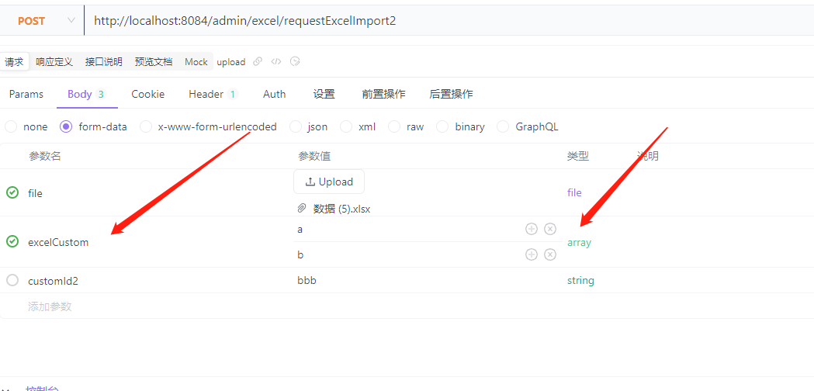
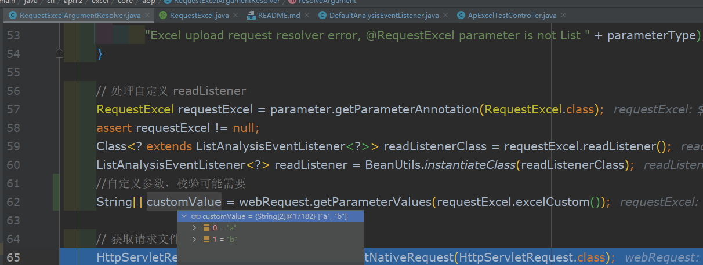
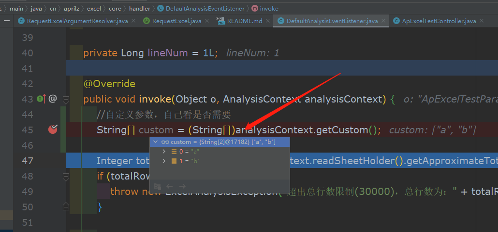
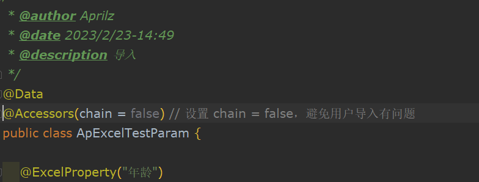
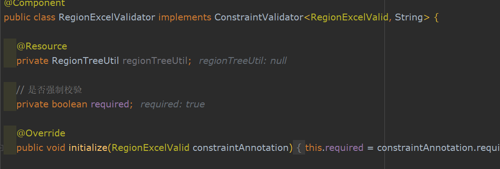
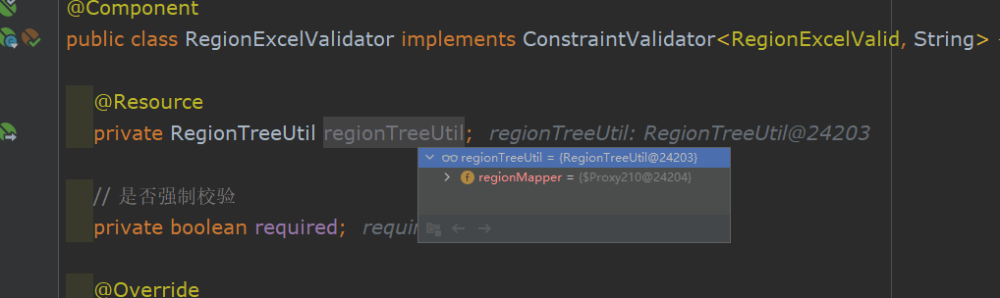

# tiny
代码地址 ： https://github.com/aprilz-code/tiny.git  
代码生成器地址：https://github.com/aprilz-code/code-generate.git

Mybatis-Plus基础框架,包括Mybatis-Plus-Generator。 登录/注册,以及完整的RBAC权限管理系统。

各种设计模式各案例以及编程式事务，以及工具类整理。 待补充。。。

## 1. TransactionSynchronizationManager.registerSynchronization
    编程式事务

## 2. lombok 1.14版本以上`支持全局配置{@see lombok.config}
lombok全局配置

## 3. starter包相关 `
 
### 3.1 easyexcel导出，数据过多，查询java.lang.OutOfMemoryError: GC overhead limit exceeded，采取分页然后写入excel

具体用法详见ApExcelTestController 内

```java
package com.aprilz.tiny.controller;

import com.aprilz.excel.core.annotations.RequestExcel;
import com.aprilz.excel.core.annotations.ResponseExcel;
import com.aprilz.excel.core.annotations.Sheet;
import com.aprilz.excel.core.exception.ErrorMessage;
import com.aprilz.excel.core.util.ExcelUtil;
import cn.hutool.core.collection.CollUtil;
import com.aprilz.tiny.common.api.CommonResult;
import com.aprilz.tiny.mbg.entity.ApExcelTest;
import com.aprilz.tiny.service.IApExcelTestService;
import com.aprilz.tiny.service.impl.ApExcelTest2ServiceImpl;
import com.aprilz.tiny.vo.request.ApExcelTestParam;
import org.springframework.validation.BindingResult;
import org.springframework.web.bind.annotation.*;
import org.springframework.web.multipart.MultipartFile;

import javax.annotation.Resource;
import javax.servlet.http.HttpServletResponse;
import java.io.IOException;
import java.util.ArrayList;
import java.util.List;

/**
 * <p>
 * excel-test表 前端控制器
 * </p>
 *
 * @author Aprilz
 * @since 2023-02-22
 */
@RestController
@RequestMapping("/excel")
public class ApExcelTestController {

    @Resource
    private IApExcelTestService iApExcelTestService;

    @Resource
    private ApExcelTest2ServiceImpl test2Service;

    @GetMapping("/list")
    public CommonResult<List<ApExcelTest>> getAll() {
        return CommonResult.success(iApExcelTestService.list());
    }

    /**
     * 普通导出数据
     * @param response
     * @throws IOException
     */
    @GetMapping("/test")
    public void test(HttpServletResponse response) throws IOException {
        List<ApExcelTest> datas = iApExcelTestService.lambdaQuery().last("limit 2000").list();
        // 输出
        ExcelUtil.write(response, "test", "数据", ApExcelTest.class, datas);

    }


    /**
     * 注解式导出单sheet数据
     * @param response
     * @return
     * @throws IOException
     */
    @GetMapping("/responseExcelTest")
    @ResponseExcel(name = "数据")
    // @ResponseExcel(name = "数据", sheets = @Sheet(sheetName = "testSheet1"))
    public List<ApExcelTest> test2(HttpServletResponse response) throws IOException {
        List<ApExcelTest> datas = iApExcelTestService.lambdaQuery().last("limit 2000").list();
        return datas;
    }

    /**
     * 注解式导出多页数据
     * @param response
     * @return
     * @throws IOException
     */
    @GetMapping("/sheetTest")
    @ResponseExcel(name = "数据", sheets = {@Sheet(sheetName = "testSheet1"), @Sheet(sheetName = "testSheet2")})
    public List<List<ApExcelTest>> test3(HttpServletResponse response) throws IOException {
        List<List<ApExcelTest>> lists = new ArrayList<>();
        List<ApExcelTest> datas1 = iApExcelTestService.lambdaQuery().last("limit 2000").list();
        lists.add(datas1);
        List<ApExcelTest> datas2 = iApExcelTestService.lambdaQuery().last("limit 2001,2000").list();
        lists.add(datas2);
        return lists;
    }

    /**
     *  普通导入数据
     * @param file
     * @return
     * @throws Exception
     */
    @PostMapping("/import")
    public CommonResult<String> importExcel(@RequestParam("file") MultipartFile file
    ) throws Exception {
//        List<ApExcelTestParam> list = EasyExcel.read(file.getInputStream(), ApExcelTestParam.class, BeanUtils.instantiateClass(DefaultAnalysisEventListener.class)).sheet()
//                .doReadSync();
        List<ApExcelTestParam> list = ExcelUtil.read(file, ApExcelTestParam.class);
        System.out.println(list);
        //入库
        return CommonResult.success();
    }

    /**
     * 注解式导入数据
     * @param dataList
     * @param bindingResult
     * @return
     */
    @PostMapping("/requestExcelImport")
    public CommonResult<String> upload(@RequestExcel List<ApExcelTestParam> dataList, BindingResult bindingResult) {
        // JSR 303 校验通用校验获取失败的数据
        List<ErrorMessage> errorMessageList = (List<ErrorMessage>) bindingResult.getTarget();
        if (CollUtil.isNotEmpty(errorMessageList)) {
            // System.out.println(errorMessageList.toString());
            return CommonResult.error(errorMessageList.toString());
        }
        //  System.out.println(errorMessageList);
        System.out.println(dataList);
        //入库
        return CommonResult.success();
    }


    /**
     * 注解式导入数据  **支持传入自定义参数去检验 **
     * @param dataList
     * @param bindingResult
     * @return
     */
    @PostMapping("/requestExcelImport2")
    public CommonResult<String> requestExcelImport2(@RequestExcel List<ApExcelTestParam> dataList, String excelCustom, BindingResult bindingResult) {
        // JSR 303 校验通用校验获取失败的数据
        List<ErrorMessage> errorMessageList = (List<ErrorMessage>) bindingResult.getTarget();
        if (CollUtil.isNotEmpty(errorMessageList)) {
            // System.out.println(errorMessageList.toString());
            return CommonResult.error(errorMessageList.toString());
        }
        //  System.out.println(errorMessageList);
        System.out.println(dataList);
        //入库
        return CommonResult.success();
    }


    /**
     * 模拟大批量数据导入
     * @return
     */
    @PostMapping("/upload3")
    public CommonResult<String> upload3(@RequestParam("file") MultipartFile file) throws IOException {
        iApExcelTestService.upload3(file);
        return CommonResult.success();
    }


    /**
     * 模拟大批量数据导入
     * @return
     */
    @PostMapping("/test3")
    public CommonResult<String> test3() throws IOException {
        test2Service.writeData(new ArrayList<ApExcelTestParam>(), 0, 2000);
        return CommonResult.success();
    }
}

```

**支持传入自定义参数去检验 **
    假如商品excel导入入库时，需校验商品必须是同一分类下，则需要传入分类id。（例子可能不恰当，意思自行理解）
    则传入excelCustom参数，可传入string或者array接收

```java
package cn.aprilz.excel.core.annotations;

import com.aprilz.excel.core.handler.DefaultAnalysisEventListener;
import com.aprilz.excel.core.handler.ListAnalysisEventListener;

import java.lang.annotation.*;

/**
 * 导入excel
 *
 * @date 2021/4/16
 */
@Documented
@Target({ElementType.PARAMETER})
@Retention(RetentionPolicy.RUNTIME)
public @interface RequestExcel {

    /**
     * 前端上传字段名称 file
     */
    String fileName() default "file";

    /**
     * 自定义扩展字段
     */
    String excelCustom() default "excelCustom";

    /**
     * 读取的监听器类
     *
     * @return readListener
     */
    Class<? extends ListAnalysisEventListener<?>> readListener() default DefaultAnalysisEventListener.class;

    /**
     * 是否跳过空行
     *
     * @return 默认跳过
     */
    boolean ignoreEmptyRow() default false;

    /**
     * 指定读取的标题行
     *
     * @return
     */
    int headRowNumber() default 1;

}

```







**支持字典转换**
写 ： 继承DictDataApi(项目中-DictDataSearch),然后使用例如
```java
    @ExcelProperty(value = "性别", converter = DictConvert.class)
    @DictFormat("dic_sex")
    private Integer sex;
```


**新增注解 @FieldRepeat，处理excel导入数据时的重复校验字段**
```java
package cn.aprilz.excel.core.annotations;

import javax.validation.Payload;
import java.lang.annotation.ElementType;
import java.lang.annotation.Retention;
import java.lang.annotation.RetentionPolicy;
import java.lang.annotation.Target;

/**
 * @author Aprilz
 * @date 2023/3/10-9:33
 * @description 导入数据字段重复性校验使用
 *  使用示例 @FieldRepeat(fields={"name","typeCode"},message="字典名称重复，请重新输入！")
 */
@Target({ElementType.TYPE})
@Retention(RetentionPolicy.RUNTIME)
public @interface FieldRepeat {
    /**
     * 需要校验的字段
     * @return
     */
    String [] fields() default {};

    String message() default "存在重复数据";

}

```

**新增@DropDownFields 注解，处理自定义数据下拉框**
使用如ApExcelTest，支持固定值，动态值下拉框，实现IDropDownService接口，重写
getSource接口，可参考 DictDataSearch类

**ExcelLine给导入时Long类型字段写入行号，其他类型不可用**
```java
package cn.aprilz.excel.core.annotations;

import java.lang.annotation.*;

@Documented
@Target({ElementType.FIELD})
@Retention(RetentionPolicy.RUNTIME)
public @interface ExcelLine {

}

```


小tips：
导入Excel时发现，属性值一直为null。。。。结果发现lombok和easyexcel冲突，解决方案如下



### 3.2 dtp 意为动态线程池。基于nacos动态@refresh原理实现


用法如下
nacos新建dataId为dtp.yml，group为DEFAULT_GROUP，修改的需要搜索dtp，然后同步修改nacosListener等位置
```yaml
dtp:
executors:
- name: t1
  core-pool-size: 25
  maximum-pool-Size: 100
- name: t2
  core-pool-size: 20
  maximum-pool-Size: 110
```

```java
import org.springframework.web.bind.annotation.RestController;

@RestController
public class A {
    
    @GetMapping("/test")
    public CommonResult<String> test() {
        DtpExecutor t1 = DtpUtil.get("t1");
        for (int i = 0; i < 50; i++) {
            t1.execute(() -> {
                try {
                    Thread.sleep(30000);
                    log.error(Thread.currentThread().getName() + "===isOk");
                } catch (InterruptedException e) {
                    e.printStackTrace();
                }
            });
        }
        return success("");
    }
}

```

修改dtp.yml里配置，然后查看NacosListener的监听方法

starter springboot2.7.5及以上使用META-INF-spring下文件，2.7.5以下使用spring.factories,也可使用mico-auto包，自动生成META-INF文件

```xml
   <!-- mica-auto -->
        <dependency>
            <groupId>net.dreamlu</groupId>
            <artifactId>mica-auto</artifactId>
            <version>${mica.version}</version>
            <scope>provided</scope>
        </dependency>
```

## 4.批量插入
### 1. xml <foreach>方式，sql长度有限制，不好排查
### 2. ExecutorType.BATCH 。。。。需要在url后面开启rewriteBatchedStatements=true，不然没效果。。（这里排查了半天，晕了 ）
具体用法参考： ApExcelTest2ServiceImpl 和 MybatisBatchUtils


https://github.com/aprilz-code/tiny.git


util使用：
TreeUtil 使用示例看代码


designMode 下 设计模式代码整理

    observer 观察者模式
    strategy 策略模式
    proxy 代理模式 


springboot集成hibernate-validator实现校验,自定义校验中无法注入spring bean
使用validator时，发现加了@compent，但是service无法注入


解决办法如下：
```java
package com.aprilz.tiny.config;

import org.hibernate.validator.HibernateValidator;
import org.springframework.beans.factory.config.AutowireCapableBeanFactory;
import org.springframework.boot.autoconfigure.condition.ConditionalOnMissingBean;
import org.springframework.context.annotation.Bean;
import org.springframework.context.annotation.Configuration;
import org.springframework.validation.beanvalidation.SpringConstraintValidatorFactory;

import javax.validation.Validation;
import javax.validation.Validator;
import javax.validation.ValidatorFactory;

/**
 * @author Aprilz
 * @date 2023/3/13-14:37
 * @description 自定义校验config
 */
@Configuration
public class ValidatorConfig {

    /**
     * 快速返回校验器
     *
     * @return
     */
    @Bean
    @ConditionalOnMissingBean(value = Validator.class)
    public Validator validator(AutowireCapableBeanFactory beanFactory) {
        //hibernate-validator 6.x没问题，7.x有问题
        ValidatorFactory validatorFactory = Validation.byProvider(HibernateValidator.class)
                .configure()
                .constraintValidatorFactory(new SpringConstraintValidatorFactory(beanFactory))// 使用spring代理，
             //   .failFast(true) //不需要快速失败,需要则打开
                .buildValidatorFactory();
        return validatorFactory.getValidator();
    }

}

```


excel中同上，Validators类中使用自定义validators
```java
package cn.aprilz.excel.core;

import cn.hutool.extra.spring.SpringUtil;

import javax.validation.*;
import java.util.Set;

/**
 * 校验工具
 *
 * @author L.cm
 */
public final class Validators {

    private Validators() {
    }

    private static final Validator VALIDATOR;

    static {
        
//        ValidatorFactory factory = Validation.buildDefaultValidatorFactory();
//        VALIDATOR = factory.getValidator();
        //使用自定义validator
        VALIDATOR= SpringUtil.getBean("validator");
    }

    /**
     * Validates all constraints on {@code object}.
     *
     * @param object object to validate
     * @param <T>    the type of the object to validate
     * @return constraint violations or an empty set if none
     * @throws IllegalArgumentException if object is {@code null} or if {@code null} is
     *                                  passed to the varargs groups
     * @throws ValidationException      if a non recoverable error happens during the
     *                                  validation process
     */
    public static <T> Set<ConstraintViolation<T>> validate(T object) {
        return VALIDATOR.validate(object);
    }

}

```

再次尝试，发现已经可以注入bean了


原因分析 ConstraintValidatorFactory 默认实现类ConstraintValidatorFactoryImpl ，使用INSTANCE创建对象，不受spring管理
，所以这里改用SpringConstraintValidatorFactory即可


### 杂记
